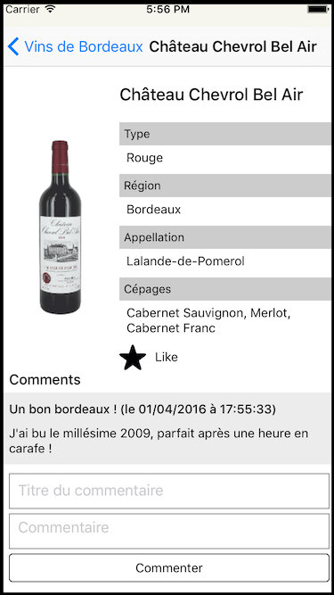
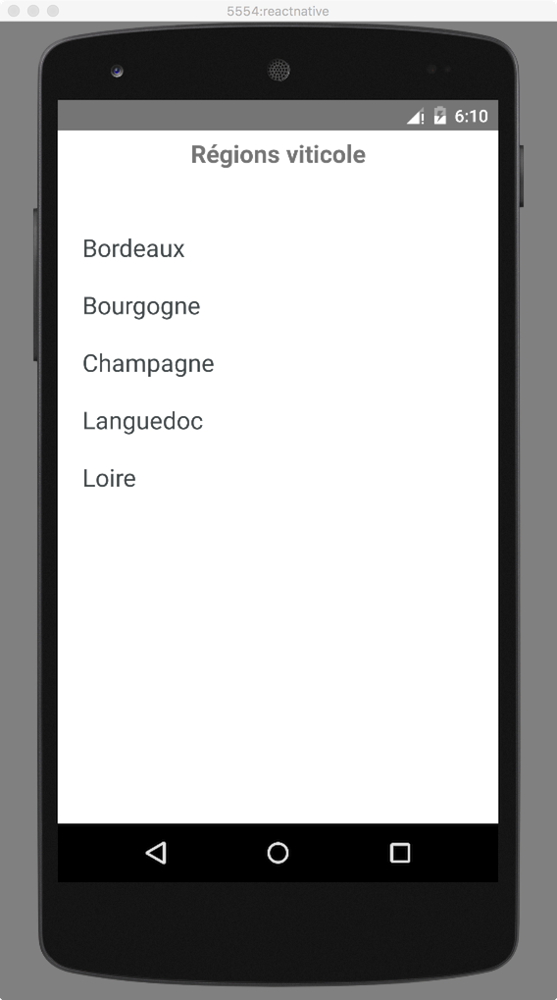
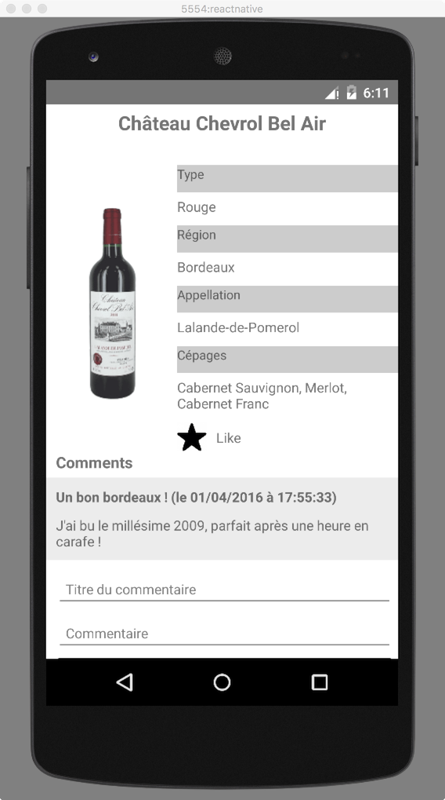

# Step 8 : React Native

## Pré-requis

Le code disponible dans cette étape à une application React Native avec un minimum de code pour commencer dans de bonnes conditions.

Pour lancer l'application, exécutez la commande `npm start` (après avoir fait un `npm install`), n'oubliez pas de lancer l'API (lancez la commande `npm start` dans le dossier `api`).

## Objectif

Ecrire l'application de gestion de vin pour mobile en `react-native`

## Mise en place de l'environnement

### iOS

ouvrez le projet `step-8/ios/wines.xcodeproject` dans `xcode` et lancerz le projet dans un émulateur (iPhone 6). Faites `Cmd+D` et activez le `Live reload` pour recharger l'application au fur et à mesure des changements dans le code.

### Android

Vous pouvez suivre [cette documentation](https://facebook.github.io/react-native/docs/android-setup.html#content) sur le site de `react-native`.

En ce qui concerne l'émulateur, si vous n'avez rien d'existant pour le moment (émulateur, Genymotion), vous pouvez suivre [cette partie de la documentation](https://facebook.github.io/react-native/docs/android-setup.html#alternative-create-a-stock-google-emulator) en utilisant le nom d'émulateur `reactnative` et en utilisant `1Go` de mémoire interne et `1Go` de mémoire externe (Android Lolipop, API 22, 1Go de stockage interne, 1Go de stockage SD, Nexus 5, nommé `reactnative`)

ouvrez le projet `step-8/android` dans `Android Studio`, lancez l'émulateur (manuellement ou avec la commande `npm start run-adv`), déployez l'application (avec la commande `npm start install-android`) et lancez la depuis le menu application du device Android. Faites `Ctrl+F2` et activez le `Live reload` pour recharger l'application au fur et à mesure des changements dans le code.

## Passage de l'application en `react-native`

Un des avantage de `react-native` est de pouvoir faire de la réutilisation de code, nous allons donc pouvoir récupérer une bonne partie du code de notre application.

### iOS

*La page de sélection de la région*

*La page de sélection du vin*

*La page de description du vin avec un commentaire*

*La page de description du vin avec un favori*

### Android

*La page de sélection de la région*

*La page de sélection du vin*

*La page de description du vin avec un commentaire*

*La page de description du vin avec un favori*

*TODO*

## A vous de jouer !

Surtout ne restez pas bloqués ! N'hésitez pas à demander de l'aide aux organisateurs du workshop ou bien à jetter un oeil au code disponible dans la [version corrigée](../step-8-done) ;-)

## Prochaine étape

Une fois cette étape terminée, vous pouvez aller consulter la [version corrigée](../step-8-done)
