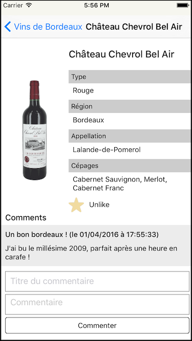

# Step 8 : React Native

## Pré-requis

Le code disponible dans cette étape à une application [`react-native`](https://facebook.github.io/react-native) avec un minimum de code pour commencer dans de bonnes conditions.

Pour lancer l'application, exécutez la commande `npm start` (après avoir fait un `npm install`), n'oubliez pas de lancer l'API (lancez la commande `npm start` dans le dossier `api`).

## Objectif

Ecrire l'application de gestion de vin pour mobile en [`react-native`](https://facebook.github.io/react-native)

## Mise en place de l'environnement

Pour cette partie, vous aurez besoin d'installer quelques petites choses en plus par rapport à la version web.

### iOS

Commencez par vous rendre [sur le Mac App Store](https://itunes.apple.com/fr/app/xcode/id497799835?mt=12) et installez Xcode.

Une fois Xcode installé, ouvrez le projet `step-8/ios/wines.xcodeproject` dans `xcode` et lancez le projet dans un émulateur (iPhone 6). Faites `Cmd+D` et activez le `Live reload` pour recharger l'application au fur et à mesure des changements dans le code.


### Android

Commencez par installer un [JDK8](http://www.oracle.com/technetwork/java/javase/downloads/jdk8-downloads-2133151.html), [Gradle](http://gradle.org/gradle-download/), et [Android Studio](http://developer.android.com/sdk/index.html)

Vous pouvez ensuite suivre [cette documentation](https://facebook.github.io/react-native/docs/android-setup.html#content) sur le site de `react-native`.

En ce qui concerne l'émulateur, si vous n'avez rien d'existant pour le moment (émulateur, Genymotion), vous pouvez suivre [cette partie de la documentation](https://facebook.github.io/react-native/docs/android-setup.html#alternative-create-a-stock-google-emulator) en utilisant le nom d'émulateur `reactnative` et en utilisant `1Go` de mémoire interne et `1Go` de mémoire externe (Android Lolipop, API 22, 1Go de stockage interne, 1Go de stockage SD, Nexus 5, nommé `reactnative`)

Ouvrez le projet `step-8/android` dans `Android Studio`, lancez l'émulateur (manuellement ou avec la commande `npm start run-adv`), déployez l'application (avec la commande `npm start install-android`) et lancez la depuis le menu application du device Android. Faites `Ctrl+F2` et activez le `Live reload` pour recharger l'application au fur et à mesure des changements dans le code.

## Passage de l'application en `react-native`

Un des avantage de `react-native` est de pouvoir faire de la réutilisation de code, nous allons donc pouvoir récupérer une bonne partie du code de notre application.

Voici ce que devrait donner l'application une fois finie

### iOS


*La page de sélection de la région*


*La page de sélection du vin*


*La page de description du vin avec un commentaire*



*La page de description du vin avec un favori*

### Android


*La page de sélection de la région*


*La page de sélection du vin*


*La page de description du vin avec un commentaire*


*La page de description du vin avec un favori*

## Mise en place de l'environnement

Cette partie décrit comment créer le projet `react-native` à titre informatif car ce dernier a déjà été créé dans l'étape 8 avec quelques additions pour pouvoir se lancer plus rapidement. Pour pouvez cependant dérouler le scénario dans un dossier à part pour maitriser le procéssus.

Commencez par installer le client `react-native` de manière globale (`-g`)sur votre système.

```
npm install -g react-native-cli
```

Sous Linux et Mac OS, vous aurez surement besoin d'installer `watchman`, suivez les [instructions d'installation](https://facebook.github.io/watchman/docs/install.html).

puis créer votre projet à l'endroit désiré

```
react-native init wines
```

maintenant il ne reste plus qu'à lancer l'application dans un émulateur.

### iOS

Ouvrez le projet `wines/ios/wines.xcodeproject` dans `xcode` et lancez le projet dans un émulateur (iPhone 6). Faites `Cmd+D` et activez le `Live reload` pour recharger l'application au fur et à mesure des changements dans le code. Essayez de modifier le contenu de `wines/index.ios.js` pour voir vos modifications s'appliquer directement.

### Android

Ouvrez le projet `wines/android` dans `Android Studio`, lancez l'émulateur (manuellement ou avec la commande `npm start run-adv`), déployez l'application (avec la commande `npm start install-android`) et lancez la depuis le menu application du device Android. Faites `Ctrl+F2` et activez le `Live reload` pour recharger l'application au fur et à mesure des changements dans le code.

## Let's code !!!

*TODO*

## A vous de jouer !

Surtout ne restez pas bloqués ! N'hésitez pas à demander de l'aide aux organisateurs du workshop ou bien à jetter un oeil au code disponible dans la [version corrigée](../step-8-done) ;-)

## Bonus

Vous pouvez rajouter le compteur de stats globales présent dans la version web (qui a volontairement été oublié) à la version mobile. A vous de fouiller [la documentation `react-native`](https://facebook.github.io/react-native/docs/getting-started.html) afin de trouver un belle façon d'intégrer cette nouvelle fonctionnalité.


## Prochaine étape

Une fois cette étape terminée, vous pouvez aller consulter la [version corrigée](../step-8-done)
